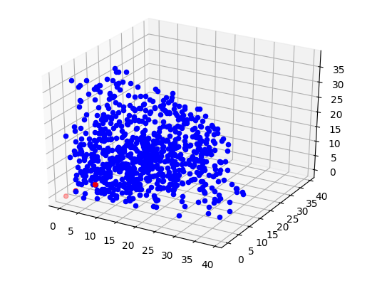

# Spaceship Path Optimization
If a spaceship was launched from earth with the goal to go as fast as possible
(so it can go as far as possible as quickly as possible). What speed can it 
achieve? How many assists should (or can) it use?

The solution will show the paths of greatest velocity, along with the velocities 
the ship can obtain.


## Example Output
```
Size max_distance is 2.6634733333333336 parsecs per 1 unit
num is 119615

Starting Simulation:

Ion Propulsion
size of total_paths is 32381
Stars:	5	Final Velocity:	450.7997723432896	km/s
Stars:	5	Final Velocity:	448.5139528868448	km/s
Stars:	5	Final Velocity:	445.2736262530786	km/s
Stars:	5	Final Velocity:	442.798857207814	km/s
Stars:	5	Final Velocity:	438.33305782183515	km/s
Stars:	4	Final Velocity:	344.9302847836076	km/s
Stars:	4	Final Velocity:	344.032428386883	km/s
Stars:	4	Final Velocity:	342.26248250697864	km/s
Stars:	4	Final Velocity:	341.38142157159524	km/s
```


## About
This project acts as my midterm and final exam for PHYS 3150 - Computational
Physics - at Clemson University. 

The star data was retrieved from [hyg](http://www.astronexus.com/hyg). 

## Assumptions
* The only objects in the universe are fixed stars (with velocities).
* The ship is the proposed second stage of the SLS
* The engine is an ideal rocket-propulsion engine

## Formulas
* Mass-luminocity equation
  * (L/L0) = (M/M0)^a, a = 3.5
* Tsiolkovsky rocket equation
  * vf = v0 + ve*ln(M0/Mf)
* Gravitational Assist
  * (1-m/M)(vi+2u)*sqrt(1-((4u*vf(1-cos(theta)))/(vi+2u)^2))

## Limits and criticisms
* The program currently only considers one set of values
* Recursion depth is hard-coded
* Sorting is used too much/takes too long
* Only considers one octant of universe
* Does not record time
* Paths due not prune as much as they should
* Only stars are plotted, not vectors
* Contains dead code

## Running
1. `git clone https://github.com/harrisonhall/comp`
2. Download `hygdata_v3.csv` from [hyg](http://www.astronexus.com/hyg)
into `mod`.
2. `cd comp`
3. `python3.6 main.py`
