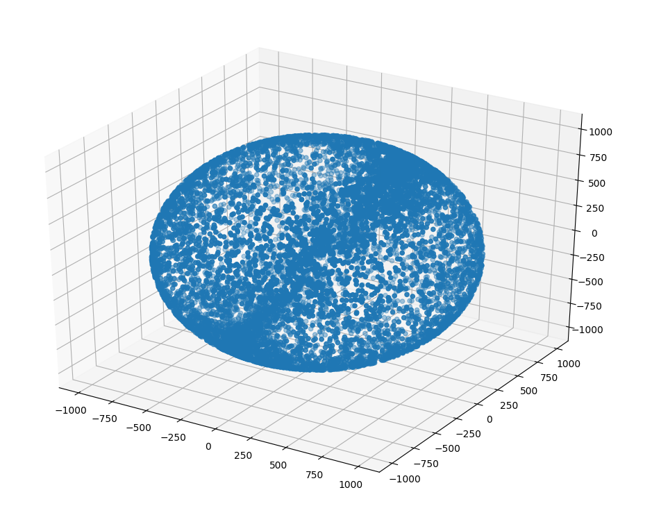

# Computational Physics Optimization
Given a few approximations (all stars are the same size and positions can only 
be integers) this program computationally solves a problem where a 
spaceship/rocket starting on the x-axis will need to optimize its path through 
the stars such that it 1) can only move forward (90 degrees) or diagonally 
(45 degrees or 135 degrees) 2) wants to optimize its path based on the least 
amount of changes of direction (or possibly the least amount of fuel, where it 
takes less fuel to change a direction 90 degrees vs 45 degrees). 

> The atoms of our bodies are traceable to stars that manufactured them in their
> cores and exploded these enriched ingredients across our galaxy, billions of 
> years ago. For this reason, we are biologically connected to every other 
> living thing in the world. We are chemically connected to all molecules on 
> Earth. And we are atomically connected to all atoms in the universe. We are 
> not figuratively, but literally stardust. ~ Tyson

## About
This project acts as my midterm and final exam for PHYS 3150 - Computational
Physics - at Clemson University. 

`hygdata_v3.csv`, the star and mass positional data was retrieved
from [hyg](http://www.astronexus.com/hyg). 

## Goals
* Base goals
  * Computationally optmize path based on least number of thrusts
* Compair to:
  * Optimize path for energy
    * Paths with 45
  * Optimize path for star mass
    * Only move in directions with stars
    * Stars with bigger masses/shorter distances require less energy

## Running
1. `git clone https://github.com/harrisonhall/comp`
2. `cd comp`
3. `python3.6 file.py`
