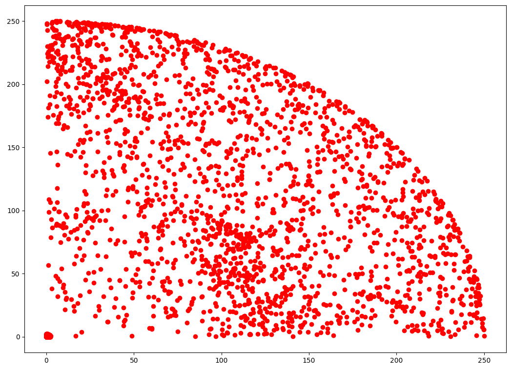

# Computational Physics Optimization
Given a few approximations (all stars are the same size and positions can only 
be integers) this program computationally solves a problem where a 
spaceship/rocket starting on the x-axis will need to optimize its path through 
the stars such that it 1) can only move forward (90 degrees) or diagonally 
(45 degrees or 135 degrees) 2) wants to optimize its path based on the least 
amount of changes of direction (or possibly the least amount of fuel, where it 
takes less fuel to change a direction 90 degrees vs 45 degrees). 

## About
`hygdata_v3.csv` is from [hyg](http://www.astronexus.com/hyg). 

## Goals
* Base goals
  * Computationally optmize path
* Stretch goals
  * Optimize path for energy
  * Optimize path for star mass

## Running
1. `git clone https://github.com/harrisonhall/comp`
2. `cd comp`
3. `python3.6`
